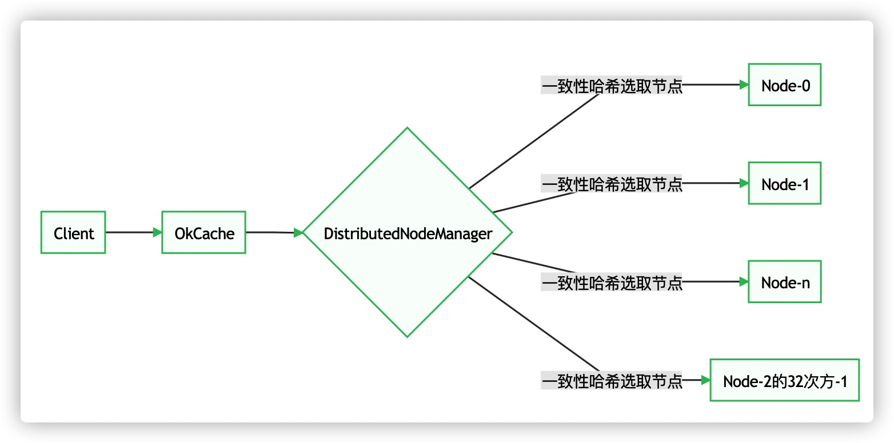

#  一致性哈希实现的缓存(OkCache)


## 整体架构


备注：所有数据分片存储到所以节点，当移除或增加1个node，仅影响差不多一个节点数据量的数据访问不到，其他90%的数据仍能一致性的获取到。

* OkCache（Cache的Client端实现）
> 提供给用户透明一致的数据存取。

* DistributedNodeManager（分布式节点管理器）
> 1. 管理节点
> 2. 提供key和节点的对应关系算法，实现分布式数据水平伸缩扩缩容的数据访问一致性。

* Node（Cache的Server端实现）
> 真正的数据存储与获取。

测试输入：1000w个数据，100个服务器，每台服务器100个虚拟节点
>注意：测试数据较大，需设置jvm参数（`VM options: -Xms2g -Xmx2g `）

## 相同数据，算法不同：测试结果
1. ##### 采用CRC32的hash算法
```text
开始存储10000000个kv数据
测试输出一个数据：
Name93939:0.07804853963130809
打印缓存统计信息如下:
服务器(192.168.0.0): 存储58508个数据
...
服务器(192.168.0.99): 存储93597个数据
总共100台服务器, kv总数据量：10000000个
平均值：100000.00
最大值：163129,（163.13%）
最小值：58508,（58.51%）
极差：104621,（104.62%）
标准差：17881.78,（17.88%）
```

2. ##### 采用Google Guava的哈希算法
```text
开始存储10000000个kv数据
测试输出一个数据：
Name93939:0.6989422059059499
打印缓存统计信息如下:
服务器(192.168.0.0): 存储116470个数据
...
服务器(192.168.0.99): 存储104443个数据
总共100台服务器, kv总数据量：10000000个
平均值：100000.00
最大值：133019,（133.02%）
最小值：82196,（82.20%）
极差：50823,（50.82%）
标准差：7726.40,（7.73%）
```
> 数据的散列程度取决于hash算法的好坏。常见哈希算法：md5/sha1/sha128/sha256. 
> java的hashcode的算法实现，散列度就差很多。但散列算法使用的不同场景，考虑的指标也不同：java的hashcode是快，分布式环境考虑数据的均匀分布，网络通信领域考虑数据的安全性

#### 算法相同，数据和服务器数量不同：测试结果
1. ##### 10台服务器、100个虚拟节点
```text
开始存储1000w个kv数据
...
总共10台服务器, kv总数据量：10000000个
平均值：1000000.00
最大值：1203222,（120.32%）
最小值：863464,（86.35%）
极差：339758,（33.98%）
标准差：78529.20,（7.85%）
```
2. ##### 10台服务器、1w个虚拟节点
```text
开始存储1000w个kv数据
...
总共10台服务器, kv总数据量：10000000个
平均值：1000000.00
最大值：1019501,（101.95%）
最小值：976318,（97.63%）
极差：43183,（4.32%）
标准差：7902.40,（0.79%）

```
> 虚拟节点越大，标准差百分比越小，分布越均匀

## 结论：
一致性哈希算法的使用场景时分布式，重点考虑数据的散列程度和速度，不太关注安全性。它解决了数据分片时系统水平伸缩带来的数据失效问题。通过虚拟节点使每个节点均匀散列到环上，避免因数据倾斜导致系统负载不均衡问题。

## 附录：一致性hash核心实现代码
```text
    SortedMap<Integer, Node> hashCircle = new TreeMap<Integer, Node>();//java 排序树

    //初始化一致性hash环
    for(Node node : nodes) {
​       for (int i = 0; i < virtualNums; i++) {
​           hashCircle.put(hash(node.toString() + i), node);
        }
    }

    //计算key对应的服务器node
    int hash = getHash(key);  //计算key的hash值
    if (!hashCircle.containsKey(hash)) { //key的hash值是否和虚拟节点的hash相同
​       SortedMap<Integer, String> tailMap = hashCircle.tailMap(hash);//key的右子树
​       hash = tailMap.isEmpty() ? hashCircle.firstKey() : tailMap.firstKey();
​   }
    return hashCircle.get(hash);
```
